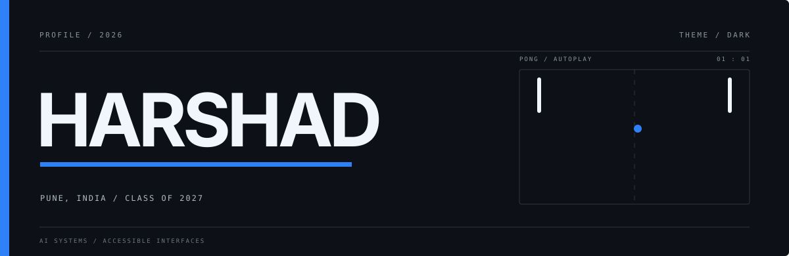

  <picture>
    <source media="(prefers-color-scheme: dark)" srcset="./assets/hero-dark.svg">
    <source media="(prefers-color-scheme: light)" srcset="./assets/hero-light.svg">
    
  </picture>

  <a href="https://linkedin.com/in/harshad-s-gore">LinkedIn</a>
  &nbsp;&nbsp;·&nbsp;&nbsp;
  <a href="https://x.com/urHarshad">X</a>
  &nbsp;&nbsp;·&nbsp;&nbsp;
  <a href="https://instagram.com/ur.harshad">Instagram</a>
  &nbsp;&nbsp;·&nbsp;&nbsp;
  <a href="https://github.com/Harshad-Gore?tab=repositories">Repositories</a>

## About

I am Harshad, an engineering student at MIT Academy of Engineering in Pune, graduating in 2027. My current work is focused on applied AI systems and accessible human-computer interaction.

## Projects

<table>
  <tr>
    <td width="50%" valign="top">
      <h3><a href="https://github.com/Harshad-Gore/spring-ai-rag-orchestrator">Spring AI RAG Orchestrator</a></h3>
      
A full-stack platform for creating document workspaces, ingesting PDF, DOCX, and TXT sources, and asking questions with grounded answers and inline citations.

      
SPRING BOOT · SPRING AI · REACT · POSTGRESQL · PGVECTOR

      <a href="https://github.com/Harshad-Gore/spring-ai-rag-orchestrator">Open repository</a> · <a href="./docs/spring-ai-rag-orchestrator.md">Architecture and evidence</a>
    </td>
    <td width="50%" valign="top">
      <h3><a href="https://github.com/Harshad-Gore/indian-sign-language-two-way-communication">Indian Sign Language: Two-Way Communication</a></h3>
      
A two-way system that converts text or speech into animated ISL and recognizes camera-based signing as text or speech.

      
REACT · TYPESCRIPT · FASTAPI · MEDIAPIPE · PYTORCH

      <a href="https://github.com/Harshad-Gore/indian-sign-language-two-way-communication">Open repository</a> · <a href="./docs/indian-sign-language.md">Architecture and evidence</a>
    </td>
  </tr>
</table>

## Verification

The profile workflow checks out both repositories and independently builds the RAG backend and both frontends, while also enforcing ISL frontend lint and recognition tests. The case studies record the verified baseline and the remaining limitations.

## Tools

<table>
  <tr>
    <td width="33%" valign="top">
      <strong>Application</strong>  
      Java and Spring Boot 
      Python and FastAPI 
      React and TypeScript 
      Vite and Tailwind CSS
    </td>
    <td width="33%" valign="top">
      <strong>AI and vision</strong>  
      Spring AI 
      PyTorch 
      MediaPipe 
      Whisper 
      CWASA and SiGML
    </td>
    <td width="33%" valign="top">
      <strong>Data and infrastructure</strong>  
      PostgreSQL and pgvector 
      Supabase 
      S3-compatible storage 
      Docker 
      Git and GitHub
    </td>
  </tr>
</table>

## Contact

For project discussions and collaboration, reach me through [LinkedIn](https://linkedin.com/in/harshad-s-gore) or [X](https://x.com/urHarshad).
