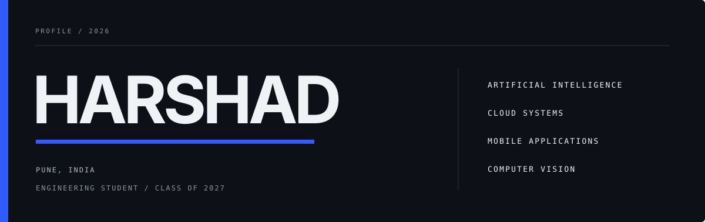

  

  <a href="https://linkedin.com/in/harshad-s-gore">LinkedIn</a>
  &nbsp;&nbsp;·&nbsp;&nbsp;
  <a href="https://x.com/urHarshad">X</a>
  &nbsp;&nbsp;·&nbsp;&nbsp;
  <a href="https://instagram.com/ur.harshad">Instagram</a>
  &nbsp;&nbsp;·&nbsp;&nbsp;
  <a href="https://github.com/Harshad-Gore?tab=repositories">Repositories</a>

## About

I am Harshad, an engineering student at MIT Academy of Engineering in Pune, graduating in 2027. My projects currently span applied machine learning, computer vision, cloud systems, web applications, and Flutter.

## Selected projects

<table>
  <tr>
    <td width="50%" valign="top">
      <h3><a href="https://github.com/Harshad-Gore/Global-Air-Quality-And-Weather-Data-Unification">Global Air Quality and Weather Data Unification</a></h3>
      
A single interface for working with environmental and weather data from multiple sources.

      DATA · APIs · WEB
    </td>
    <td width="50%" valign="top">
      <h3><a href="https://github.com/Harshad-Gore/Sign-Language-Interpreter">Sign Language Interpreter</a></h3>
      
A computer-vision project for interpreting sign-language gestures.

      PYTHON · COMPUTER VISION
    </td>
  </tr>
  <tr>
    <td width="50%" valign="top">
      <h3><a href="https://github.com/Harshad-Gore/serverless-order-system">Serverless Order System</a></h3>
      
An ordering workflow implemented using serverless cloud architecture.

      PYTHON · CLOUD · SERVERLESS
    </td>
    <td width="50%" valign="top">
      <h3><a href="https://github.com/Harshad-Gore/To-Do-Flutter-App">Flutter To-Do</a></h3>
      
A mobile task-management application built with Flutter and Dart.

      FLUTTER · DART
    </td>
  </tr>
</table>

<a href="https://github.com/Harshad-Gore?tab=repositories">View all repositories</a>

## Tools

<table>
  <tr>
    <td width="33%" valign="top">
      <strong>Languages</strong>  
      Python 
      JavaScript 
      Dart 
      C and C++ 
      SQL
    </td>
    <td width="33%" valign="top">
      <strong>Development</strong>  
      Flutter 
      Node.js and Express 
      Flask 
      TensorFlow and PyTorch 
      OpenCV
    </td>
    <td width="33%" valign="top">
      <strong>Platforms and data</strong>  
      Azure and Google Cloud 
      Firebase 
      MongoDB and MySQL 
      Git and GitHub 
      Figma and Blender
    </td>
  </tr>
</table>

## Contact

For project discussions and collaboration, reach me through [LinkedIn](https://linkedin.com/in/harshad-s-gore) or [X](https://x.com/urHarshad).
