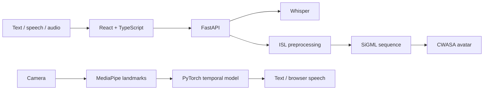

# Indian Sign Language: Two-Way Communication

## System

A two-way accessibility system: written or spoken input becomes animated Indian Sign Language, while camera-based signing becomes text and optional speech.

## Recognition model

- 158 features per frame: both hands, selected pose landmarks, and hand-presence flags.
- 71 supported ISL classes across 1,120 landmark sequences.
- Hybrid temporal architecture selected from a multi-model benchmark.

| Benchmark metric | Result |
|---|---:|
| Best validation accuracy | 96.70% |
| Macro F1 | 95.73% |
| Top-3 accuracy | 97.25% |

These are prototype validation results, not a claim of production or unseen-signer accuracy.

## Verified baseline

Validated locally on 4 July 2026.

| Check | Result |
|---|---:|
| Recognition suite | 34 passed, 12 asset-dependent tests skipped |
| TypeScript production build | Passed |
| Frontend lint | Passed with zero warnings |
| Reduced model/data environment | Optional checkpoint and dataset tests skip explicitly rather than producing false failures |

## Privacy and accessibility boundary

- Camera and microphone access require explicit browser permission.
- Raw video should remain in the browser whenever derived landmarks are sufficient.
- Predictions are assistive output, not certified interpretation.
- Confidence must remain visible and correction should remain possible.
- Facial expression and other non-manual ISL markers are not yet represented adequately.

## Open engineering work

- Establish a held-out, cross-signer evaluation protocol.
- Measure latency and robustness across camera, lighting, and distance conditions.
- Calibrate confidence and add correction feedback.
- Expand phrase-level grammar and non-manual markers.
