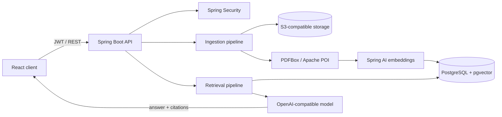

# Spring AI RAG Orchestrator

## System

A full-stack document-grounded question-answering platform. Users create isolated notebooks, ingest PDF, DOCX, text, or web sources, and query an assistant whose responses are bounded by retrieved notebook context.

## Engineering decisions

- Notebook ownership scopes documents, chunks, and conversations.
- Original files and searchable content use separate storage systems.
- Flyway controls schema evolution; JPA validates application mappings.
- Email verification precedes authenticated access.
- RAG responses retain source references instead of returning unsupported prose alone.

## Verified baseline

Validated locally on 4 July 2026.

| Check | Result |
|---|---:|
| Spring backend suite | 11 tests, 0 failures, 1 deterministic skip |
| React production build | Passed |
| Authentication flow | Signup, verification state, login, session and duplicate-account behavior covered |
| Migration startup | Flyway initialization covered against an H2 PostgreSQL-compatible fixture |

The external website extractor remains a manual smoke test because third-party availability is nondeterministic.

## Security boundary

- Signed JWT authentication through HTTP-only cookies or bearer headers.
- Explicit CORS origins and stateless server sessions.
- User ownership checks for notebook resources.
- Untrusted document parsing isolated from raw object storage.
- Provider, storage, mail, database, and token secrets supplied through environment variables.

## Open engineering work

- Add containerized PostgreSQL tests for pgvector-specific behavior.
- Introduce retrieval evaluation for relevance, citation precision, and faithfulness.
- Split the large frontend bundle and enforce a size budget.
- Finish the full frontend lint backlog before making it a required gate.
